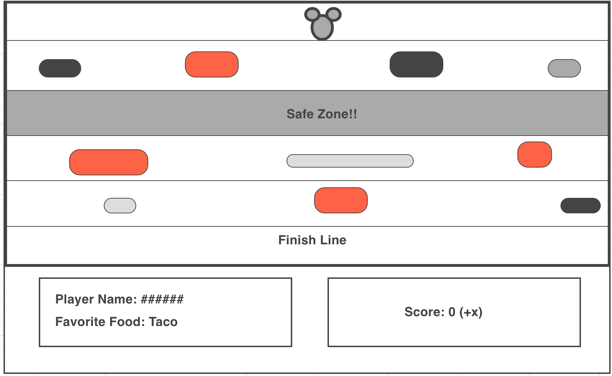
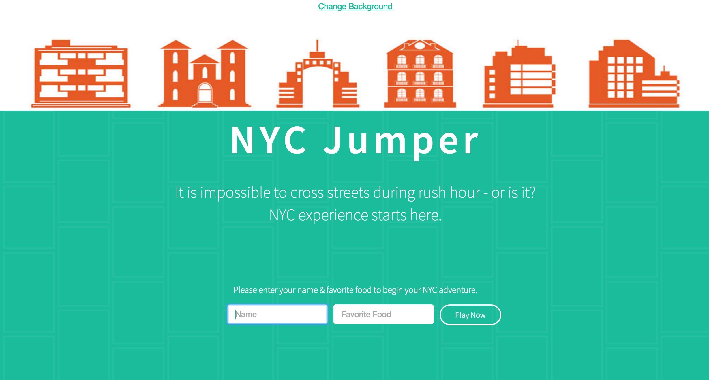
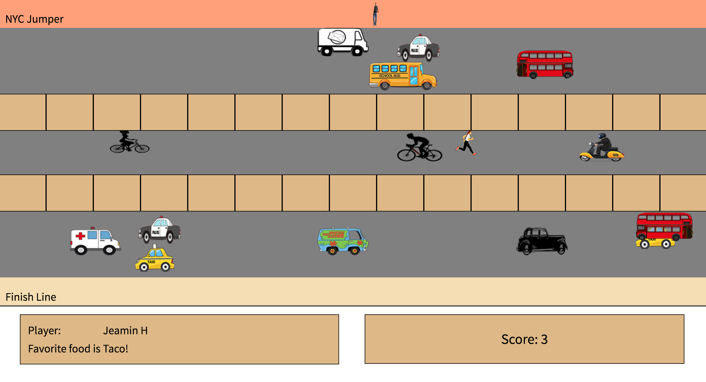

# NYC Jumper
https://jaemin-han.github.io/project1-jumper/

#Wireframe

#Landing Page

#Game Page

## Description & Instruction

- Input your name & favorite food and click 'Play Now' to begin the game.
- Single player game. The player needs to click arrow keys (left, right, up, down) to move across the street to accumulate points.
- Crossing the street safely once will get a player 1 point.
-  Safely reaching the NYC building at the bottom of the page without hitting any obstacles, the player will be awarded 1 point.
- The main goal of this game is to collect points while avoiding obstacles along the way.

## Features/Technologies Used

- Loop: Create multiple boxes in the javascript file
- Randomization: Obstacles’ speed & priority* across the window
- Collision Detection:  Game stops when a player and obstacle(s) collide
- Unique Speed & Position: All obstacles
- Arrow Keys: Player’s movement - left, top, right, and bottom
- Flexbox: Positioning the game page
- Media Query: Resize based on the screensize
- Design: various characters/obstacles
- Data transfer: Landing page to the game page
- Score (+1): Track score every time a player crosses the street
I replicated the landing page which can be found here: http://onbok.co/

**Unsolved Problems**

- Continue to work on the setInterval for my randomized obstacles. At this moment, it only works once.
- Work on Media Query to make my game responsive.
- Unable to fully understand the Get/Post form which I referenced from the previous lab exercise.

